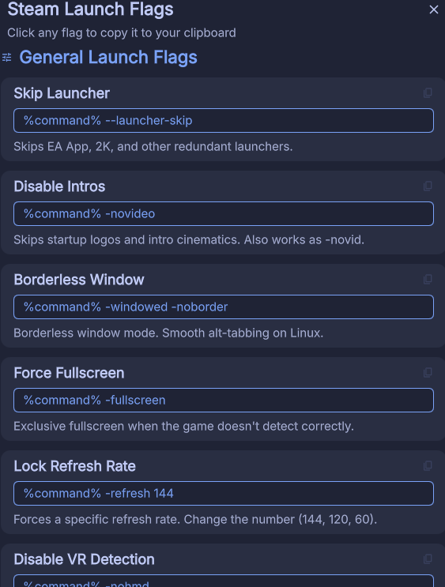

# Steam Launch Flags

Quick-access reference for Steam launch flags — right from your DankBar. Never dig through wikis again.

## Features

- **4 categories** of launch flags: General, Performance & Overlay, Proton & Compatibility, Advanced / DXVK
- **One-click copy** — click any flag to copy it to clipboard
- **Visual feedback** — card shows "✓ Copied!" confirmation on click
- **Modular** — toggle categories on/off from settings
- **Material Design 3** — follows your DMS theme automatically
- **Compositor blur** — proper layer namespace for hyprland/niri blur support

## Screenshots



## Installation

### From Plugin Registry
1. Open DMS Settings → Plugins
2. Browse registry and install "Steam Launch Flags"
3. Enable and add to your DankBar

### Manual
```bash
# Option A: Git clone
git clone https://github.com/Gateton/dank-bar-steam-flags.git \
  ~/.config/DankMaterialShell/plugins/SteamFlagsPlugin

# Option B: Download and extract
mkdir -p ~/.config/DankMaterialShell/plugins/SteamFlagsPlugin
cp plugin.json SteamFlagsWidget.qml SteamFlagsSettings.qml \
   ~/.config/DankMaterialShell/plugins/SteamFlagsPlugin/
```

Then: Settings → Plugins → Scan for Plugins → Enable → Add to DankBar.

## Usage

1. Click the 🎮 **Flags** pill in your DankBar
2. Browse flags by category
3. Click any flag card — it copies to clipboard
4. Paste into Steam's launch options for any game

### Flag Categories

| Category | Examples |
|---|---|
| **General** | Skip launcher, disable intros, borderless window, force fullscreen, refresh rate lock, disable VR/joystick |
| **Performance** | MangoHud, GameScope, Feral GameMode |
| **Proton** | WineD3D fallback, disable Esync/Fsync, enable NVAPI (DLSS/Reflex) |
| **Advanced** | DXVK HUD, async shaders, frame cap, FSR via Wine |

## Requirements

- DMS >= 1.4.0
- No external dependencies — uses built-in DMS clipboard

## License

MIT
